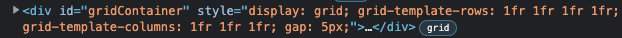

# Laboration 1, 1dv610
*Andreas Lillje*

## Checklista
  - [x] Jag har skrivit all kod och reflektioner själv. Jag har inte använt mig av andras kod för att lösa uppgiften.
  - [x] Mina testresultat är skrivna utifrån utförd testning ( och inte teoretiskt: "det bör fungera" :) )
  - [x] Koden är objektorienterad
  - [x] Jag har skrivit en modul som riktar sig till programmerare

## Egenskattning och mål
  - [ ] Jag är inte klar eftersom jag vet att jag saknar något. (Då skall du inte lämna in! Lämna då istället in på restlaboration.)
  - [ ] Jag eftersträvar med denna inlämning godkänt betyg (E-D)
    - [ ] De flesta testfall fungerar
    - [ ] Koden är förberedd på Återanvändning
    - [ ] All kod samt historik finns i git 
    - [ ] Kodkvaliterskraven är ifyllda
    - [ ] Reflektion är skriven utifrån bokens kapitel 
  - [x] Jag eftersträvar med denna inlämning högre betyg (C-B) och anser mig uppfylla alla extra krav för detta. 
    - [x] Samtliga testfall är skrivna    
    - [x] Testfall är automatiserade
    - [x] Det finns en tydlig beskrivning i hur modulen skall användas (i git)
    - [x] Kodkvalitetskraven är varierade 
  - [ ] Jag eftersträvar med denna inlämning högsta betyg (A) 

Förtydligande: Examinator kommer sätta betyg oberoende på vad ni anser. 

## Återanvändning
Jag beskriver i repositoriets README.md hur modulen ska återanvändas. 
Jag har försökt att ligga på en lagom nivå när jag beskriver användningsområdet och utgår från att användaren har grundläggande kunskaper i Javascript. 
Därefter har jag försökt att visa med tydliga exempel och förtydligat explicita begränsningar.

Beskrivningen hittas här: 
https://github.com/alillje/gridlify#readme

## Beskrivning av min kod
Såhär ser biblioteket/modulem ut på insidan.
 
GridGenerator-klassen har GridValidator, RowColumnValidator och GapValidator som attribut och har därför en assosciation till dessa klasser.
 
 
GridValidator har RowColumnValidator och GapValidator som attribut och har därför en assosciation till dessa klasser.
 
 
GapValidator ärver från RowColumnValidator (Som dock inte är en abstrakt klass, *abstract* är inte ett keyword i Javascript och kan inte användas på samma sätt som i exempelvis Java). 
 
 
Alltså ärver GapValidator egenskaper från en redan konkrekt klass då de använder sig av precis samma metoder, förutom en som omdefineras i GapValidator
 
 
RowColumnValidtor och GapValidator har beroende till två enumerationsmoduler eftersom de använder dessa i flera metoder. 
 
 
Slutligen exporteras GridGenerator till *index.js* (Som inte är en klass och inte demonstreras i klassdiagrammet nedan), där ett objekt av typen instansieras och exporteras.
 
 
</img>
 
*Class diagram*
## Hur jag testat
 *NOTE: Här har jag sedan tidigare skrivit krav, testspecifikation och testrapporter på engelska och infogar de därför som de är nedan.*
  
  
 Jag har ställt upp krav, beskrivit i testspecifikationen vilka testfall som testar vilka krav.
  
 Jag har använt automatisk och manuelt testning. Nedan beskrivs krav, testspecifikation och testrapporter.
_______________________________

## Krav | Requirements

### Functional requriements
1. The library must be able to generate a string, representing CSS code for a grid layout, based on input.

2.  The library must set the CSS grid layout of a given HTML element.  

3. The library must set grid positions of a child element in a grid layout. 

4. Grid rows, must be passed in as an array of strings. 

5. Grid columns, must be passed in as an array of strings. 

6. Grid row gaps must be passed in as a string. 

7. Grid columns must be passed in as a string.

8. All grid rows, column and gap values must be in the form of an integer followed by a valid CSS unit measurement( example: `200px`, `1fr` or `100%`. ) or  OR of a valid CSS sizing key-word)

### Non-functional requriements
9. The library should be used to simplify dynamic setting of CSS grid layouts and positioning of elements within a grid layout. 

10. The library should be written without any dependencies to other external libraries. 

11. Valid CSS units for the library must be stated in the documentation.
_______________________________

## Testfall | Test Specification

## *Requirements*
Requirements are defined in `./test/docs.requriements.md`

## *Automatic Unit tests*
Automatic unit tests are defined in `./test/index.test.js`

The automatic unit test, tests the following requriements:  
- 1  
- 4  
- 5  
- 6  
- 7  
- 8  

## *Manual tests*

Manual testing will be performed using the test application, located in the tests-folder.  
 ### *Prerequisites*
- Open the browsers web inspector and view elements, this should look something like this:  
 
 

*Note: The requriement tested is presented along with each test case.*

### TC1 Setting a grid with a gap
- (Requrements 2, 3)

#### TC1.1 
#### *Input*
1. Start the test application by opening ./tests/test-app/index.html in a web browser. 
2. Fill in input fiels as follows: 
 

3. Press `Set grid layout` button

#### *Output*
- Open browser inspector and inspect the elements.
- Find the `div`-element with the `gridContainer`-id
- The style properties of the element should be set to following:  
 
- The grid layout should be displayed in the box in the main window of the application as follows: 

- The CSS code of the parent element should be displayed in the top-left corner of the application
- The CSS code of the parent element should be displayed in the top-right corner of the application

#### TC1.2
#### *Input*
1. Start the test application by opening ./tests/test-app/index.html in a web browser. 
2. Fill in input fiels as follows: 
 

#### *Output*
- Open browser inspector and inspect the elements.
- Find the `div`-element with the `gridContainer`-id
- The style properties of the element should be set to following:  
 
- The grid layout should be displayed in the main window 
- The CSS code of the parent element should be displayed in the top-left corner of the application
- The CSS code of the parent element should be displayed in the top-right corner of the application

#### TC1.3
#### *Input*
1. Start the test application by opening ./tests/test-app/index.html in a web browser. 
2. Fill in input fiels as follows: 
 

#### *Output*
- Open browser inspector and inspect the elements.
- Find the `div`-element with the `gridContainer`-id
- The style properties of the element should be set to following:  
 
- The grid layout should be displayed in the main window 
- The CSS code of the parent element should be displayed in the top-left corner of the application
- The CSS code of the parent element should be displayed in the top-right corner of the application

#### TC1.4
#### *Input*
1. Start the test application by opening ./tests/test-app/index.html in a web browser. 
2. Fill in input fiels as follows: 
 

#### *Output*
- Open browser inspector and inspect the elements.
- Find the `div`-element with the `gridContainer`-id
- The style properties of the element should be set to following:  
 
- The grid layout should be displayed in the main window 
- The CSS code of the parent element should be displayed in the top-left corner of the application
- The CSS code of the parent element should be displayed in the top-right corner of the application

#### TC1.5
#### *Input*
1. Start the test application by opening ./tests/test-app/index.html in a web browser. 
2. Fill in input fiels as follows: 
 

#### *Output*
- Open browser inspector and inspect the elements.
- Find the `div`-element with the `gridContainer`-id
- The style properties of the element should be set to following:  
 
- The grid layout should be displayed in the main window 
- The CSS code of the parent element should be displayed in the top-left corner of the application
- The CSS code of the parent element should be displayed in the top-right corner of the application

### TC2 Setting a grid with zero gap
#### TC2.1
1. Start the test application by opening ./tests/test-app/index.html in a web browser. 
2. Fill in input fiels as follows: 
 

#### *Output*
- Open browser inspector and inspect the elements.
- Find the `div`-element with the `gridContainer`-id
- The style properties of the element should be set to following:  
 
- The grid layout should be displayed in the main window 
- The CSS code of the parent element should be displayed in the top-left corner of the application
- The CSS code of the parent element should be displayed in the top-right corner of the application

#### TC2.2
#### *Input*
1. Start the test application by opening ./tests/test-app/index.html in a web browser. 
2. Fill in input fiels as follows: 
 

#### *Output*
- Open browser inspector and inspect the elements.
- Find the `div`-element with the `gridContainer`-id
- The style properties of the element should be set to following:  
 
- The grid layout should be displayed in the main window 
- The CSS code of the parent element should be displayed in the top-left corner of the application
- The CSS code of the parent element should be displayed in the top-right corner of the application

### TC3 Setting a grid with invalid input
- (Requirements 8)
#### TC3.1 
* *Input*
1. Start the test application by opening ./tests/test-app/index.html in a web browser. 
2. Fill in input fiels as follows: 
 

3. Press `Set grid layout` button

#### *Output*
- Open browser inspector and inspect the elements.
- Find the `div`-element with the `gridContainer`-id
- Grid should not have been set on the element, as follows:  
 
- In the web inspector, open the console 
 
- The following error message should be displayed in the console 

#### TC3.2
* *Input*
1. Start the test application by opening ./tests/test-app/index.html in a web browser. 
2. Fill in input fiels as follows (leave all empty): 
 

3. Press `Set grid layout` button

#### *Output*
- Open browser inspector and inspect the elements.
- Find the `div`-element with the `gridContainer`-id
- Grid should not have been set on the element, as follows:  
 
- In the web inspector, open the console 
 
- The following error message should be displayed in the console 

#### TC3.3
* *Input*
1. Start the test application by opening ./tests/test-app/index.html in a web browser. 
2. Fill in input fiels as follows (leave all empty): 
 

3. Press `Set grid layout` button

#### *Output*
- Open browser inspector and inspect the elements.
- Find the `div`-element with the `gridContainer`-id
- Grid should not have been set on the element, as follows:  
 
- In the web inspector, open the console 
 
- The following error message should be displayed in the console 

#### TC3.4
* *Input*
1. Start the test application by opening ./tests/test-app/index.html in a web browser. 
2. Fill in input fiels as follows (leave all empty): 
 

3. Press `Set grid layout` button

#### *Output*
- Open browser inspector and inspect the elements.
- Find the `div`-element with the `gridContainer`-id
- Grid should not have been set on the element, as follows:  
 
- In the web inspector, open the console 
 
- The following error message should be displayed in the console 

________________________________

### Testrapport | Test Report

## Manual testing

### Test suite 6
- Date 23/9 2022
- version 1.0.7

#### Notes

| Test      |  |
| --------- |:----:|
| TC1.1     | OK |
| TC1.2     | OK |
| TC1.3     | OK |
| TC1.4     | OK |
| TC1.5     | OK |
| COVERAGE & SUCCESS   | 5/5 OK 

| Test      |  |
| --------- |:----:|
| TC2.1     | OK |
| TC2.2     | OK |
| COVERAGE & SUCCESS   | 2/2 OK 

| Test      |  |
| --------- |:----:|
| TC3.1     | OK |
| TC3.2     | OK |
| TC3.3     | OK |
| TC3.4     | OK |
| COVERAGE & SUCCESS   | 3/3 OK 

### Test suite 5
- Date 21/9 2022
- version 1.0.7

#### Notes
- After fixing bug to hanled negative numbers, added more manual tests to test-specification. 

| Test      |  |
| --------- |:----:|
| TC1.1     | OK |
| TC1.2     | OK |
| TC1.3     | OK |
| TC1.4     | OK |
| TC1.5     | OK |
| COVERAGE & SUCCESS   | 5/5 OK 

| Test      |  |
| --------- |:----:|
| TC2.1     | OK |
| TC2.2     | OK |
| COVERAGE & SUCCESS   | 2/2 OK 

| Test      |  |
| --------- |:----:|
| TC3.1     | OK |
| TC3.2     | OK |
| TC3.3     | OK |
| TC3.4     | OK |
| COVERAGE & SUCCESS   | 3/3 OK 

### Test suite 4
- Date 19/9 2022
- version 1.0.7

#### Notes
- Added more manual tests to test-specification. 

| Test      |  |
| --------- |:----:|
| TC1.1     | OK |
| TC1.2     | OK |
| TC1.3     | OK |
| TC1.4     | OK |
| TC1.5     | OK |
| COVERAGE & SUCCESS   | 5/5 OK 

| Test      |  |
| --------- |:----:|
| TC2.1     | OK |
| TC2.2     | OK |
| COVERAGE & SUCCESS   | 2/2 OK 

| Test      |  |
| --------- |:----:|
| TC3.1     | OK |
| TC3.2     | OK |
| TC3.3     | OK |
| COVERAGE & SUCCESS   | 3/3 OK 

### Test suite 3
- Date 15/9 2022
- version 1.0.7

#### Notes
- Added more manual tests to test-specification. 

| Test      |  |
| --------- |:----:|
| TC1.1     | OK |
| TC1.2     | OK |
| TC1.3     | OK |
| TC1.4     | OK |
| TC1.5     | OK |
| COVERAGE & SUCCESS   | 5/5 OK 

| Test      |  |
| --------- |:----:|
| TC2.1     | OK |
| TC2.2     | OK |
| COVERAGE & SUCCESS   | 2/2 OK 

| Test      |  |
| --------- |:----:|
| TC3.1     | OK |
| TC3.2     | OK |
| TC3.3     | OK |
| COVERAGE & SUCCESS   | 3/3 OK 

### Test suite 2
- Date 14/9 2022
- version 1.0.7

| Test      |  |
| --------- |:----:|
| TC1.1     | OK |
| TC1.2     | OK |
| TC1.3     | OK |
| COVERAGE & SUCCESS   | 3/3 OK 

| Test      |  |
| --------- |:----:|
| TC2.1     | OK |
| TC2.2     | OK |
| COVERAGE & SUCCESS   | 2/2 OK 

### Test suite 1
- Date 13/9 2022
- version 1.0.7

| Test      |  |
| --------- |:----:|
| TC1.1     | OK |
| TC1.2     | OK |
| TC1.3     | OK |
| COVERAGE & SUCCESS   | 3/3 OK 

| Test      |  |
| --------- |:----:|
| TC2.1     | OK |
| TC2.2     | OK |
| COVERAGE & SUCCESS   | 2/2 OK 

## Automatic Unit Testing

### Test suite 6
- Date 23/9 2022
- version 1.0.7
#### Notes

 

### Test suite 5
- Date 21/9 2022
- version 1.0.7
#### Notes
- Fix bug to handle negative numbers, added tests. Split test in to multiple test files for better readability.

 

### Test suite 4
- Date 19/9 2022
- version 1.0.7
#### Notes
- Fix bugs found in previous test suite, and edit some automatic unit tests.

 
 

### Test suite 4
- Date 16/9 2022
- version 1.0.3
#### Notes
- The code was refactored to not catch errors thrown, but let them be caught and handled by the end user. This, however, resulted in all methods that previously had try..catch blocks now fail their tests as per below. Will need to invesigate further.

 
 

### Test suite 3
- Date 13/9 2022
- version 1.0.7
#### Notes
- Added 4 additional mehtods to the the public interface and integrated unit test.
Ran test suite with PASS.

 
 
 

### Test suite 3
- Date 13/9 2022
- version 1.0.7
#### Notes
- Added more tests, and fixed bugs i previous test suite. 
All tests passed successfully.

 
 

### Test suite 2
- Date 13/9 2022
- version 1.0.7
#### Notes
- Tests have been reeimplemented as requriements has changed. After research it was discovered that the css unit suffixes most commonly used for grid-layouts were `px`, `fr`& `%`. These are now the only allowed unit suffixes for the library. Tests were re-implemented accordingly. 

Looking at the tests below, there is still a bug when trying to remove a unit suffix from input parameters.

 
 

### Test suite 1
- Date 12/9 2022
- version 1.0.7
#### Notes
- Most the implmented tests pass, however, this test reveals that the application fails to handle CSS unit suffixes that are longer than 2 characters. This is shown in the test report below.

 

## Kodkvalitetskrav

**Fetmarkera** de "regler" som används ur CC. Ni kan frångå tabellformat om ni vill. Skapa direktlänkar till er kod där det är lämpligt. Skriv så att jag kan förstå.

### Namngivning

| Namn & Förklaring     | Reflektion |
| --------- |:----:|
| **GridGenerator**  Huvudnamn på Klassen| **Avoid Disinformation**  Här tycker jag inte att jag följer reglerna för avoid disinformation. Namnet GridGenerator, antyder att klassen har som enda uppgift att generera en grid. Vilket delvis stämmer, men klassen har fler uppgifter än så, i form av att manipulera HTML element. Mitt mål är därför att hitta ett bättre namn på huvudklassen innan inlämning.  **Class Names** I det här fallet följs reglerna för hur en klass ska döpas. Klassnamnet är ett substantiv och inte ett verb. **Pick one word per concept* Samtliga metoder i denna huvudklass följer samma mönster och använder samma verb, get och set.Här blandas inte get med exempelvis fetch, eller retrieve.  Detsamma gäller för verbet set. | 
| **getGridCss( { grid } )** Tar in data i form av ett Javascript-objekt och returnerar en template för en grid-layout i form av CSS-kod. | **Use intention revealing names** Här tycker jag att jag lyckas med att ge metoden ett ett beskrivande namn. Min uppfattning är att metodnamnet en beskrivning av vad metoden faktiskt gör.  **Method Names** Har följt regeln för att metodnamn ska vara verb, eller ha verb phrase names, för de publika metoderna och använd get som ett prefix i det här fallet.
 | **getPositionCss( { grid } )** Tar in data i form av ett Javascript-objekt och returnerar ett elements position i en grid-layout i form av CSS-kod. | **Use intention revealing names** Likt gridCss() tycker jag har lyckats med detta metodnamn, dock inte lika bra.  Detta beror på att jag inte tycker att denna metod beskriver vad den gör lika bra.  **Use pronounceable names** Om jag hade velat ha ett mer deskriptivt metodnamn, hade jag kunnat döpa den till exempelvis *getCssTemplateForPositionInCssGridLayout()*. Här har jag alltså gjort en kompromiss och valt ett namn som är kortare och lättare att uttala och på så sätt kompromissat bort en del av metodens intention.  **Method Names** Har följt regeln för att metodnamn ska vara verb, eller ha verb phrase names, för de publika metoderna och använd get som ett prefix i det här fallet. |
 | **setGrid({ grid }, htmElement)** Tar in data i form av ett Javascript objekt med instruktioner för hur layouten ska se ut. Tar in en ett HTML-elements identifierare och sätter CSS-egenskaper i form av en layout på HTML-elementet. | **Don’t use misinformation** Under denna reflektion inser jag att jag döpt det andra argumentet till htmlElement, vilket är missvisande. Det är html-elementets identifierare som tas som argument och detta kommer att åtgärdas till inlämning.   **Method Names** Har följt regeln för att metodnamn ska vara verb, eller ha verb phrase names, för de publika metoderna och använd get som ett prefix i det här fallet.

### Funktioner

| Metodnamn  | Antal Rader | Reflektion |
| ---------- | ----------- |:----:|
| **GridGenerator.setPosition({ grid }, htmlElement)** | 15 | **Small** Jag anser att funktionen är lite för lång och är av uppfattningen att man skulle kunna bryta ut mer för att skriva metoden kortare  **Dyadic Functions**  Här är min känsla att det var nödvändigt att ta in två argument. Eftersom att elementet ska positioneras i ett rutnät behöver vi ha start och slutpositioner. Detta tas upp som ett exempel i boken för att använda sig av 2 argument. För att kunna veta vilket element som ska manipuleras behöver vi även detta som ett argument. När man tittar på koden, kan det se ut som att det är fler än 2 argument, men det är alltså ett objekt och en sträng som tas in. Objektet "destrueras" och extraherar dess egenskaper direkt i argumentfältet.  **Argument Objects** Här tar metoden in ett objekt med egenskaper som argument, istället för att ta in varje egenskap som ett eget argument, och minskar då antalet argument.  **Extract Try/Catch Blocks** Litteraturen föreslår att man bryter ut try..catch blocken i egna funktioner. På sätt och vis tycker jag att jag gör det här, då metoden kallar på en annan metod som sköter valideringen. Problemet jag ser här är att denna metod även bygger en sträng och returnerar. Här kan man tänka sig att man bryter ut till ytterliggare en metod som bara har som uppgift att anropa validerings-metoden. (Här korrigerade jag felhanteringen och tog bort try..catch-block helt och kastar istället undantag som användare av mitt bibliotek får fånga)   **One level of abstraction** Här blandas abstraktions nivåer då det är en låg abstratktion när själva manipuleringen av DOM-elementet sker (document.querySelector... ). Dessa operationer skulle kunna brytas ut i en egen mindre funktion.  ||
| **GridGenerator.setGrid({ grid }, htmlElement)** | 14 | **Dyadic Functions**  Här är min känsla att det var nödvändigt att ta in två argument. Eftersom att det behövs antal och längd/bredd på rader och kolumner behöver detta anges för att kunna "rita" ett rutnät. För att kunna veta vilket element som ska manipuleras behöver vi även detta som ett argument. När man tittar på koden, kan det se ut som att det är fler än 2 argument, men det är alltså ett objekt och en sträng som tas in. Objektet "destrueras" och extraherar dess egenskaper direkt i argumentfältet.  **Argument Objects** Här tar metoden in ett objekt med egenskaper som argument, istället för att ta in varje egenskap som ett eget argument, och minskar då antalet argument.  **Extract Try/Catch Blocks** Litteraturen föreslår att man bryter ut try..catch blocken i egna funktioner. På sätt och vis tycker jag att jag gör det här, då metoden kallar på en annan metod som sköter valideringen. Problemet jag ser här är att denna metod även bygger en sträng och returnerar. Här kan man tänka sig att man bryter ut till ytterliggare en metod som bara har som uppgift att anropa validerings-metoden. (Här korrigerade jag felhanteringen och tog bort try..catch-block helt och kastar istället undantag som användare av mitt bibliotek får fånga)   **One level of abstraction** Här blandas abstraktions nivåer då det är en låg abstratktion när själva manipuleringen av DOM-elementet sker (document.querySelector... ). Dessa operationer skulle kunna brytas ut i en egen mindre funktion.   |
| **RowColumnValidator.validate(columnsOrRows)** | 13 |   **Prefer Exceptions to Returning Error Codes** Metoden kastar ett *Error* istället för ett *Exception*. Här skulle man kunna göra om typen av objekt som metoden kastar. 
| **GridValidator.validatePositions(positions)** | 10 | **Do one thing** Metoden gör dessvärre flera saker och följer inte den här regeln. Metoden utvärderar alla egenskaper i objektet som den tar in som argument,tittar om det är ett nummer, sedan tittar metoden om värdena i objektet är *undefined* för att slutligen returnera. Här är målet att bryta ut till ytterliggare en funktion för att få en bättre *separation of concerns*    |
| **RowColumnValidator.isSizingKeyword(cssValue)** | 5 | **Do one thing** Metoden gör endast en sak, dvs. Tittar på ett värde och avgöra om det är en korrekt "sizing-keyword"  **Small** Funktionen är kort, den kan inte skrivas mycket kortare. Eventuellt med en tenary operator. Jag tycker dock att det i det här fallet blir lättare och tydligare att läsa med if-satser.  **Use descriptive names** Jag tycker att det framgår tydligt vad som är metodens uppgift.  **Common Monadic Forms** Här tas endast ett argument in och läses av innan funktionen returnerar. |
 

## Laborationsreflektion
Efter att ha läs kapitel 2 och 3 i kurslitteraturen (Clean Code), var det jag tog med mig initialt att skriva funktioner/metoder som skulle ha en enda uppgift och på så sätt följa regeln *Do one thing (Kap. 3, Funtions)*, genom att applicera *One level of abstraction (Kap. 3, functions)*.
 
Genom att försöka applicera dessa regler, tycker jag att det nästan automatiskt uppstod ett bättre utgångsläge att följa ytterliggare en regel, nämligen *Small! (Kap. 3, functions)*, då funktionerna blev kortare och fick ett mer isolerat anvsvarsområde. 
 
 
Jag har tidigare kommit på mig själv att ta en bekvämare väg och låta en funktion sköta flera saker, men i den här uppgiften ville jag bryta ut så mycket som möjligt i små, korta funktioner. 
 
 
En insikt är att om man gör jobbet från början, att med andra ord bryta ut delar ur funktioner i mindre funktioner så blir det betydligt lättare att navigera i koden, hitta fel och åtgärda eventuella buggar. 
 
Med detta sagt kan jag vittna om att koden jag har skrivit i den här uppgiften inte följer alla regler perfekt, men detta har alltså från början vara en målsättning för att på så sätt förbättra min egen kodkvalitet. 
 
 
Vidare har jag haft som målsättning att följa regler för namngivning, exempelvis *Use descriptive names (Kap 3., functions)*. Jag har strävat efter att vara konsekvent i namngivningen och anända samma fraser, verb och substantiv genomgående i hela kodbasen. 
 
 
En regel jag i ett fall har misslyckats att uppfylla är att inte ha för många argument i en funktion. 
I klassen GridValidator, finns en funktion som är namngiven `validateParams(rows, columns, rowGap, columnGap`. 

Enligt ltteraturen är funktioner som tar 3 argument *(Triads)*, betydligt svårare att förstå än funktioner som tar 2 argument *(Dyads)*, och i det här fallet har jag alltså 4 argument.
 
Efter denna insikt skrevs koden om. Metoden döptes om till validateAllParams(gridParams), för att förtydliga metodens uppgift något, samt att metoden tar in ett objekt istället för fyra olika parametrar. På så sätt följs regeln *Common Monadic Forms (Kap 3, functions)*. 
 
 
Namngivning av klasser har gjorts i enlighet med av litteraturen föreslagna regler. De är substantiv, och jag använder inga ord som kan missförstås. *(Kap 2., Class Names)*
Genomgående har jag även undvikit att enkoda typer i variabelnamn, enligt *(Avoid Encodings (Kap 2)*., samt varit noga med att använda uttalbara namn, enligt *Use pronounciable names (Kap 2)*.

Att även följa regeln för *Avoid Disinformation (Kap 2, Meaningful names)* har jag försökt låtit genomsyra arbetet med koden, vilket i vissa fall resulterat i något längre namn än vad som alltid är önskvärt, detta är dock något som kan vara eftersträvansvärt, eftersom att längre namn i vissa fall trumfar kortare namn, enligt regeln *Use Searchable Names (Kap 2, Meaningful names)*.
 
 
Sammanfattningsvis tycker jag att kapitel 2 och 3 i Clean Code har varit hjälpsamma i min egen strävan att skriva mer *läsbar* och *användbar* kod. 
 
Detta är någonting jag kommit till insikt med att kodkvalitet och ens förmåga att skriva "bättre" kod, är och kommer att vara en ständigt pågående process, vilket också ger en möjligheten att ständigt utvecklas. 
 