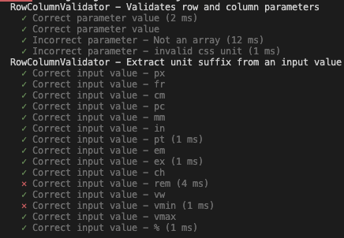

# Test Report

## Automatic Unit Testing

### Test suite 1
- Date 12/9 2022
- Version 1.1.0
#### Notes
- Most the implmented tests pass, however, this test reveals that the application fails to handle CSS unit suffixes that are longer than 2 characters. This is shown in the test report below.

 