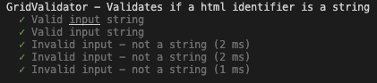

# Test Report

## Manual testing

### Test suite 3
- Date 19/9 2022
- version 1.0.4

#### Notes
- Added more manual tests to test-specification. 

| Test      |  |
| --------- |:----:|
| TC1.1     | OK |
| TC1.2     | OK |
| TC1.3     | OK |
| TC1.4     | OK |
| TC1.5     | OK |
| COVERAGE & SUCCESS   | 5/5 OK 

| Test      |  |
| --------- |:----:|
| TC2.1     | OK |
| TC2.2     | OK |
| COVERAGE & SUCCESS   | 2/2 OK 

| Test      |  |
| --------- |:----:|
| TC3.1     | OK |
| TC3.2     | OK |
| TC3.3     | OK |
| COVERAGE & SUCCESS   | 3/3 OK 

### Test suite 3
- Date 15/9 2022
- version 1.0.4

#### Notes
- Added more manual tests to test-specification. 

| Test      |  |
| --------- |:----:|
| TC1.1     | OK |
| TC1.2     | OK |
| TC1.3     | OK |
| TC1.4     | OK |
| TC1.5     | OK |
| COVERAGE & SUCCESS   | 5/5 OK 

| Test      |  |
| --------- |:----:|
| TC2.1     | OK |
| TC2.2     | OK |
| COVERAGE & SUCCESS   | 2/2 OK 

| Test      |  |
| --------- |:----:|
| TC3.1     | OK |
| TC3.2     | OK |
| TC3.3     | OK |
| COVERAGE & SUCCESS   | 3/3 OK 

### Test suite 2
- Date 14/9 2022
- version 1.0.4

| Test      |  |
| --------- |:----:|
| TC1.1     | OK |
| TC1.2     | OK |
| TC1.3     | OK |
| COVERAGE & SUCCESS   | 3/3 OK 

| Test      |  |
| --------- |:----:|
| TC2.1     | OK |
| TC2.2     | OK |
| COVERAGE & SUCCESS   | 2/2 OK 

### Test suite 1
- Date 13/9 2022
- version 1.0.4

| Test      |  |
| --------- |:----:|
| TC1.1     | OK |
| TC1.2     | OK |
| TC1.3     | OK |
| COVERAGE & SUCCESS   | 3/3 OK 

| Test      |  |
| --------- |:----:|
| TC2.1     | OK |
| TC2.2     | OK |
| COVERAGE & SUCCESS   | 2/2 OK 

## Automatic Unit Testing

### Test suite 4
- Date 19/9 2022
- version 1.0.3
#### Notes
- Fix bugs found in previous test suite, and edit some automatic unit tests.

 
 

### Test suite 4
- Date 16/9 2022
- version 1.0.3
#### Notes
- The code was refactored to not catch errors thrown, but let them be caught and handled by the end user. This, however, resulted in all methods that previously had try..catch blocks now fail their tests as per below. Will need to invesigate further.

 
 

### Test suite 3
- Date 13/9 2022
- version 1.0.4
#### Notes
- Added 4 additional mehtods to the the public interface and integrated unit test.
Ran test suite with PASS.

 
 
 

### Test suite 3
- Date 13/9 2022
- version 1.0.4
#### Notes
- Added more tests, and fixed bugs i previous test suite. 
All tests passed successfully.

 
 

### Test suite 2
- Date 13/9 2022
- version 1.0.4
#### Notes
- Tests have been reeimplemented as requriements has changed. After research it was discovered that the css unit suffixes most commonly used for grid-layouts were `px`, `fr`& `%`. These are now the only allowed unit suffixes for the library. Tests were re-implemented accordingly. 

Looking at the tests below, there is still a bug when trying to remove a unit suffix from input parameters.

 
 

### Test suite 1
- Date 12/9 2022
- version 1.0.4
#### Notes
- Most the implmented tests pass, however, this test reveals that the application fails to handle CSS unit suffixes that are longer than 2 characters. This is shown in the test report below.

 
