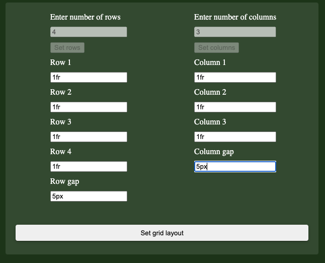
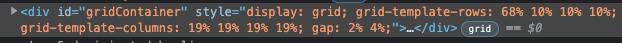

# Test Specification

## *Requirements*
Requirements are defined in `./test/docs.requriements.md`

## *Automatic Unit tests*
Automatic unit tests are defined in `./test/index.test.js`

The automatic unit test, tests the following requriements:  
- 1  
- 4  
- 5  
- 6  
- 7  
- 8  

## *Manual tests*

Manual testing will be performed using the test application, located in the tests-folder.  
 ### *Prerequisites*
- Open the browsers web inspector and view elements, this should look something like this:  
 
 

*Note: The requriement tested is presented along with each test case.*

### TC1 Setting a grid with a gap
- (Requrements 2, 3)

#### TC1.1 
* Input
1. Start the test application by opening ./tests/test-app/index.html in a web browser. 
2. Fill in input fiels as follows: 

3. Press `Set grid layout` button

* Output 
- Open browser inspector and inspect the elements.
- Find the `container` element
- The style properties of the element should be set to following:  
 
- The grid layout should be displayed in the box in the main window of the application as follows: 

### TC1 Setting a grid with a gap
- (Requrements 2, 3)

#### TC1.1 
* Input
1. Start the test application by opening ./tests/test-app/index.html in a web browser. 
2. Set number of rows to `3`
3. Set height of rows to `1`
4. Set row unit to `fr`
5. Set row gap to `5`
6. Set row gap unit to `%`
7. Set number of columns to `4`
8. Set width of columns to `1`
9. Set column unit to `fr`
10. Set column gap to `5`
11. Set column gap unit to `%`
12. Press `Set grid layout` button

* Output 
- Open browser inspector and inspect the elements.
- Find the `container` element
- The style properties of the element should be set to following:  
 
- The grid layout should be displayed in the box in the main window of the application as follows: 

#### TC1.2
* Input
1. Start the test application by opening ./tests/test-app/index.html in a web browser. 
2. Set number of rows to `5`
3. Set height of rows to `50`
4. Set row unit to `px`
5. Set row gap to `10`
6. Set row gap unit to `px`
7. Set number of columns to `6`
8. Set width of columns to `100`
9. Set column unit to `px`
10. Set column gap to `10`
11. Set column gap unit to `px`
12. Press `Set grid layout` button

* Output
* Output 
- Open browser inspector and inspect the elements.
- Find the `container` element
- The style properties of the element should be set to following:  
 
- The grid layout should be displayed in the box in the main window of the application as follows: 

#### TC1.3
* Input
1. Start the test application by opening ./tests/test-app/index.html in a web browser. 
2. Set number of rows to `4`
3. Set height of rows to `20`
4. Set row unit to `%`
5. Set row gap to `5`
6. Set row gap unit to `px`
7. Set number of columns to `5`
8. Set width of columns to `18`
9. Set column unit to `%`
10. Set column gap to `2`
11. Set column gap unit to `px`
12. Press `Set grid layout` button

* Output
* Output 
- Open browser inspector and inspect the elements.
- Find the `container` element
- The style properties of the element should be set to following:  
 
- The grid layout should be displayed in the box in the main window of the application as follows: 

### TC2 Setting a grid with invalid input
- (Requirements 8)
#### TC2.1 
* Input
1. Start the test application by opening ./tests/test-app/index.html in a web browser. 
2. Set number of rows to `3`
3. Set height of rows to `abc`
4. Set row unit to `px`
5. Set row gap to `DEF`
6. Set row gap unit to `px`
7. Set number of columns to `4`
8. Set width of columns to `ghi`
9. Set column unit to `fr`
10. Set column gap to `JkL`
11. Set column gap unit to `px`
12. Press `Set grid layout` button

* Output 
- Open browser inspector and inspect the elements.
- Find the `container` element
- Grid should not have been set on the element, as follows:  
 
- In the web inspector, open the console 
 
- The following error message should be displayed in the console 

#### TC2.2 
* Input
1. Start the test application by opening ./tests/test-app/index.html in a web browser. 
2. Set number of rows to `10`
3. Set height of rows to `!=+`
4. Set row unit to `px`
5. Set row gap to `*,.`
6. Set row gap unit to `px`
7. Set number of columns to `7`
8. Set width of columns to `-<>`
9. Set column unit to `fr`
10. Set column gap to `?/#`
11. Set column gap unit to `px`
12. Press `Set grid layout` button

* Output 
- Open browser inspector and inspect the elements.
- Find the `container` element
- Grid should not have been set on the element, as follows:  
 
- In the web inspector, open the console 
 
- The following error message should be displayed in the console 

