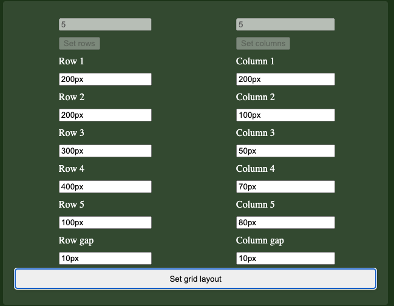
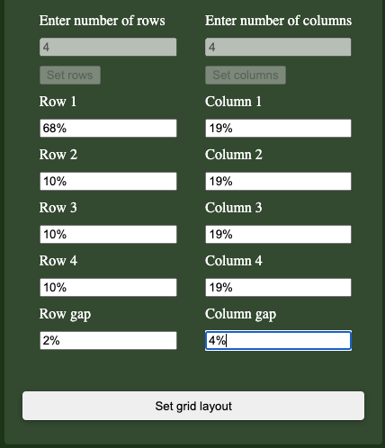

# Test Specification

## *Requirements*
Requirements are defined in `./test/docs.requriements.md`

## *Automatic Unit tests*
Automatic unit tests are defined in `./test/index.test.js`

The automatic unit test, tests the following requriements:  
- 1  
- 4  
- 5  
- 6  
- 7  
- 8  

## *Manual tests*

Manual testing will be performed using the test application, located in the tests-folder.  
 ### *Prerequisites*
- Open the browsers web inspector and view elements, this should look something like this:  
 
 

*Note: The requriement tested is presented along with each test case.*

### TC1 Setting a grid with a gap
- (Requrements 2, 3)

#### TC1.1 
#### *Input*
1. Start the test application by opening ./tests/test-app/index.html in a web browser. 
2. Fill in input fiels as follows: 
 

3. Press `Set grid layout` button

#### *Output*
- Open browser inspector and inspect the elements.
- Find the `div`-element with the `gridContainer`-id
- The style properties of the element should be set to following:  
 
- The grid layout should be displayed in the box in the main window of the application as follows: 

- The CSS code of the parent element should be displayed in the top-left corner of the application
- The CSS code of the parent element should be displayed in the top-right corner of the application

#### TC1.2
#### *Input*
1. Start the test application by opening ./tests/test-app/index.html in a web browser. 
2. Fill in input fiels as follows: 
 

#### *Output*
- Open browser inspector and inspect the elements.
- Find the `div`-element with the `gridContainer`-id
- The style properties of the element should be set to following:  
 
- The grid layout should be displayed in the main window 
- The CSS code of the parent element should be displayed in the top-left corner of the application
- The CSS code of the parent element should be displayed in the top-right corner of the application

#### TC1.3
#### *Input*
1. Start the test application by opening ./tests/test-app/index.html in a web browser. 
2. Fill in input fiels as follows: 
 

#### *Output*
- Open browser inspector and inspect the elements.
- Find the `div`-element with the `gridContainer`-id
- The style properties of the element should be set to following:  
 
- The grid layout should be displayed in the main window 
- The CSS code of the parent element should be displayed in the top-left corner of the application
- The CSS code of the parent element should be displayed in the top-right corner of the application

#### TC1.4
#### *Input*
1. Start the test application by opening ./tests/test-app/index.html in a web browser. 
2. Fill in input fiels as follows: 
 

#### *Output*
- Open browser inspector and inspect the elements.
- Find the `div`-element with the `gridContainer`-id
- The style properties of the element should be set to following:  
 
- The grid layout should be displayed in the main window 
- The CSS code of the parent element should be displayed in the top-left corner of the application
- The CSS code of the parent element should be displayed in the top-right corner of the application

#### TC1.5
#### *Input*
1. Start the test application by opening ./tests/test-app/index.html in a web browser. 
2. Fill in input fiels as follows: 
 

#### *Output*
- Open browser inspector and inspect the elements.
- Find the `div`-element with the `gridContainer`-id
- The style properties of the element should be set to following:  
 
- The grid layout should be displayed in the main window 
- The CSS code of the parent element should be displayed in the top-left corner of the application
- The CSS code of the parent element should be displayed in the top-right corner of the application

### TC2 Setting a grid with zero gap
#### TC2.1
1. Start the test application by opening ./tests/test-app/index.html in a web browser. 
2. Fill in input fiels as follows: 
 

#### *Output*
- Open browser inspector and inspect the elements.
- Find the `div`-element with the `gridContainer`-id
- The style properties of the element should be set to following:  
 
- The grid layout should be displayed in the main window 
- The CSS code of the parent element should be displayed in the top-left corner of the application
- The CSS code of the parent element should be displayed in the top-right corner of the application

#### TC2.2
#### *Input*
1. Start the test application by opening ./tests/test-app/index.html in a web browser. 
2. Fill in input fiels as follows: 
 

#### *Output*
- Open browser inspector and inspect the elements.
- Find the `div`-element with the `gridContainer`-id
- The style properties of the element should be set to following:  
 
- The grid layout should be displayed in the main window 
- The CSS code of the parent element should be displayed in the top-left corner of the application
- The CSS code of the parent element should be displayed in the top-right corner of the application

### TC3 Setting a grid with invalid input
- (Requirements 8)
#### TC3.1 
* *Input*
1. Start the test application by opening ./tests/test-app/index.html in a web browser. 
2. Fill in input fiels as follows: 
 

3. Press `Set grid layout` button

#### *Output*
- Open browser inspector and inspect the elements.
- Find the `div`-element with the `gridContainer`-id
- Grid should not have been set on the element, as follows:  
 
- In the web inspector, open the console 
 
- The following error message should be displayed in the console 

#### TC3.2
* *Input*
1. Start the test application by opening ./tests/test-app/index.html in a web browser. 
2. Fill in input fiels as follows (leave all empty): 
 

3. Press `Set grid layout` button

#### *Output*
- Open browser inspector and inspect the elements.
- Find the `div`-element with the `gridContainer`-id
- Grid should not have been set on the element, as follows:  
 
- In the web inspector, open the console 
 
- The following error message should be displayed in the console 

#### TC3.3
* *Input*
1. Start the test application by opening ./tests/test-app/index.html in a web browser. 
2. Fill in input fiels as follows (leave all empty): 
 

3. Press `Set grid layout` button

#### *Output*
- Open browser inspector and inspect the elements.
- Find the `div`-element with the `gridContainer`-id
- Grid should not have been set on the element, as follows:  
 
- In the web inspector, open the console 
 
- The following error message should be displayed in the console 

