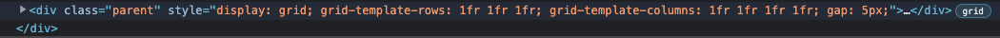
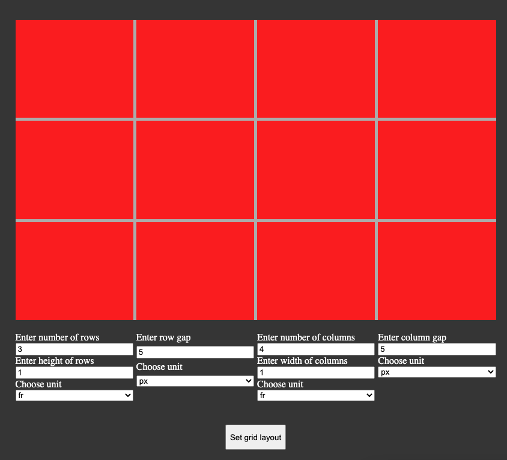

# Test Specification

## Manual testings

Manual testing will be performed using the test application, located in the tests-folder. 

### TC1 Setting a grid with a gap

#### TC1.1 
* Input
1. Start the test application by opening ./tests/test-app/index.html in a web browser. 
2. Set number of rows to `3`
3. Set height of rows to `1`
4. Set row unit to `fr`
5. Set row gap to `5`
6. Set row gap unit to `px`
7. Set number of columns to `4`
8. Set width of columns to `1`
9. Set column unit to `fr`
10. Press `Set grid layout` button

* Output 
- Open browser inspector and inspect the elements.
- Find the `parent` element
- The style properties of the element should be set to following:  
 
- The grid layout should be displayed in the box in the main window of the application as follows: 

#### TC1.2
* Input
1. Start the test application by opening ./tests/test-app/index.html in a web browser. 
2. Set number of rows to `3`
3. Set height of rows to `1`
4. Set row unit to `fr`
5. Set row gap to `5`
6. Set row gap unit to `px`
7. Set number of columns to `4`
8. Set width of columns to `1`
9. Set column unit to `fr`
10. Press `Set grid layout` button
